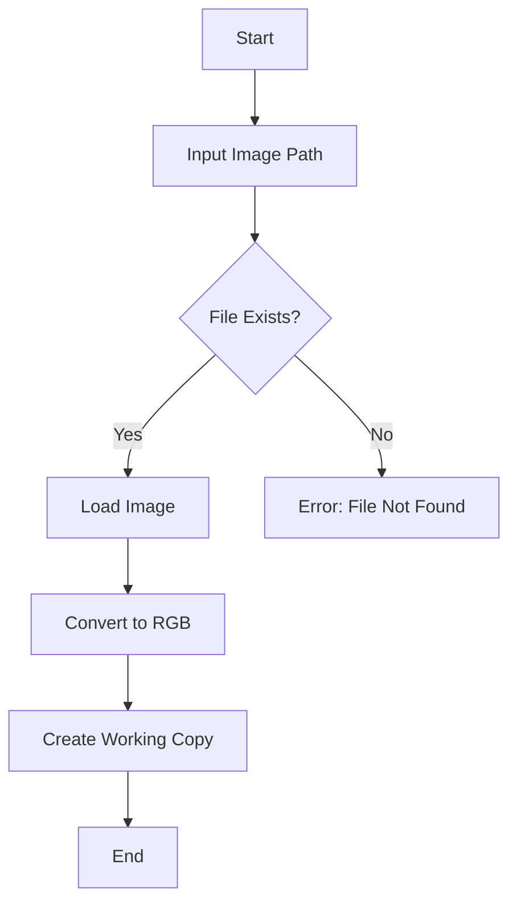
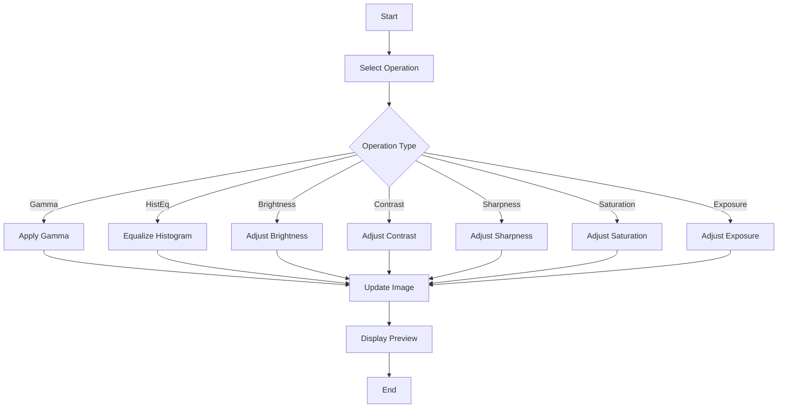

# Technical Documentation

## System Architecture

### High-Level Overview
```
┌─────────────────┐     ┌─────────────────┐     ┌─────────────────┐
│  Image Loading  │────▶│ Image Processing│────▶│  Image Saving   │
└─────────────────┘     └─────────────────┘     └─────────────────┘
        │                        │                        │
        ▼                        ▼                        ▼
┌─────────────────┐     ┌─────────────────┐     ┌─────────────────┐
│  Error Handling │     │  User Interface │     │ File Management │
└─────────────────┘     └─────────────────┘     └─────────────────┘
```

## Image Processing Pipeline

### 1. Image Loading Process


### 2. Processing Flow


## Implementation Details

### Core Functions

#### 1. Image Loading (`load_image`)
- Input: File path (string)
- Output: PIL Image object
- Error Handling:
  - FileNotFoundError
  - ValueError for invalid images
- Converts to RGB color space

#### 2. Image Saving (`save_image`)
- Input: PIL Image, path, quality
- Output: None
- Features:
  - Optimized JPEG encoding
  - Minimal PNG compression
  - Quality preservation

#### 3. Image Processing Functions

##### Gamma Correction (`apply_gamma`)
```python
def apply_gamma(image, gamma=1.0):
    # Convert to float array
    arr = img_as_float(np.array(image))
    # Apply gamma correction
    corrected = exposure.adjust_gamma(arr, gamma)
    # Clip values to [0,1]
    corrected = np.clip(corrected, 0, 1)
    # Convert back to uint8
    return Image.fromarray(img_as_ubyte(corrected))
```

##### Histogram Equalization (`apply_hist_eq`)
```python
def apply_hist_eq(image):
    # Convert to NumPy array
    arr = np.array(image)
    # Convert to YCrCb
    ycrcb = cv2.cvtColor(arr, cv2.COLOR_RGB2YCrCb)
    # Equalize Y channel
    ycrcb[:, :, 0] = cv2.equalizeHist(ycrcb[:, :, 0])
    # Convert back to RGB
    rgb = cv2.cvtColor(ycrcb, cv2.COLOR_YCrCb2RGB)
    return Image.fromarray(rgb)
```

## Performance Considerations

### Memory Management
- Uses numpy arrays for efficient computation
- Implements copy-on-write for image modifications
- Cleans up temporary arrays after processing

### Processing Speed
- Optimized color space conversions
- Efficient array operations
- Minimal memory copying

## Error Handling

### Input Validation
```python
try:
    img = load_image(path)
except FileNotFoundError:
    print("Error: File not found")
except ValueError:
    print("Error: Invalid image format")
```

### Processing Errors
```python
try:
    current = apply_gamma(current, g)
except Exception as e:
    print(f"Error during processing: {e}")
```

## Testing

### Unit Tests
- Image loading/saving
- Processing functions
- Error handling
- Edge cases

### Integration Tests
- Complete processing pipeline
- User interface
- File operations

## Dependencies

### Core Libraries
- OpenCV (cv2) 4.5.0+
- NumPy 1.19.0+
- Pillow 8.0.0+
- scikit-image 0.18.0+

### Optional Dependencies
- matplotlib (for visualization)
- pytest (for testing)

## Future Improvements

### Planned Features
1. Batch processing
2. GUI interface
3. Advanced filters
4. Image analysis tools

### Performance Optimizations
1. Parallel processing
2. GPU acceleration
3. Memory optimization

## References

### Academic Papers
1. "Digital Image Processing" by Gonzalez and Woods
2. "Computer Vision: Algorithms and Applications" by Richard Szeliski

### Technical Resources
1. OpenCV Documentation
2. scikit-image Documentation
3. Pillow Documentation

## Version History

### v1.0.0
- Initial release
- Basic image processing functions
- Command-line interface

### v1.1.0 (Planned)
- GUI interface
- Batch processing
- Advanced filters 